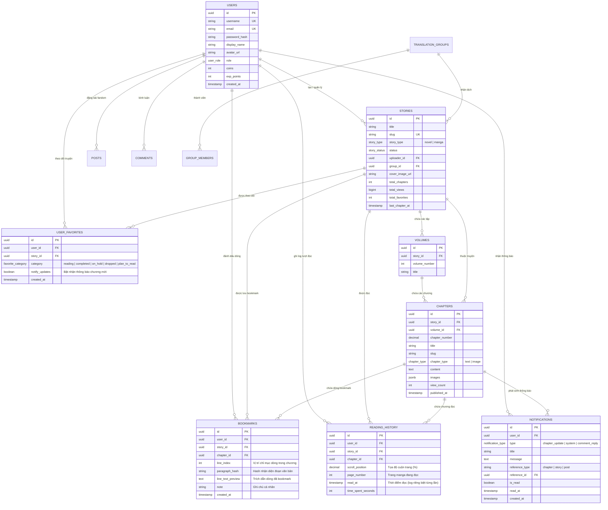
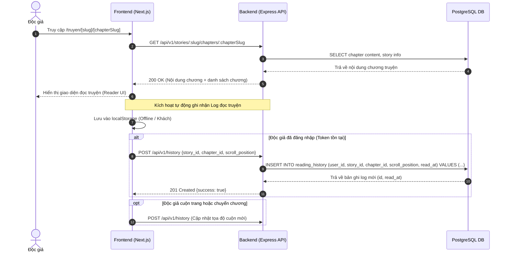
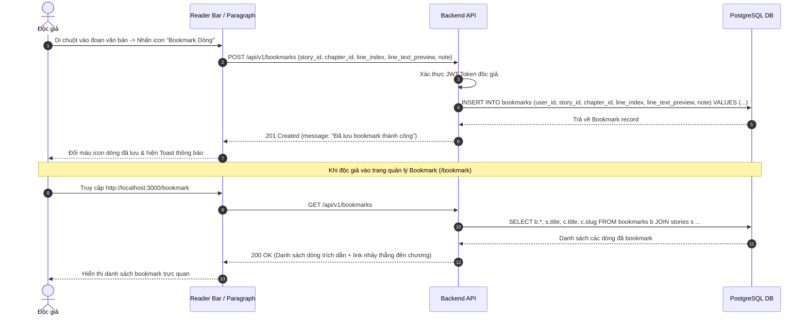
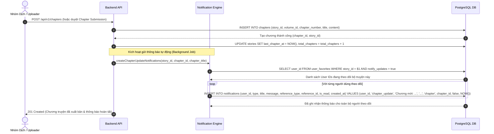
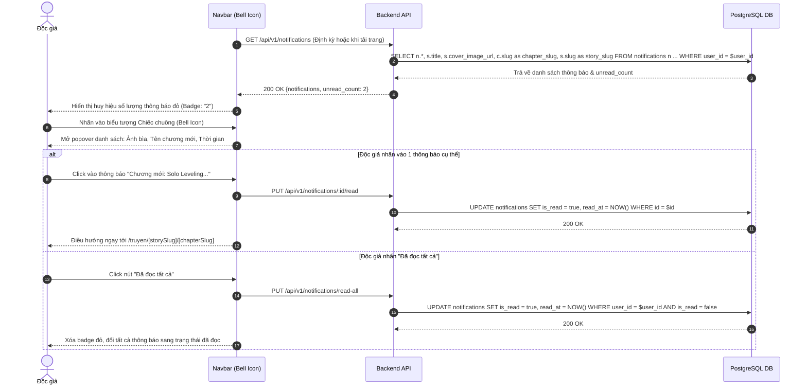

# 📚 NovelHub - Light Novel & Manga Platform

Hệ thống đọc **Light Novel (Truyện chữ)** & **Manga (Truyện tranh)** trực tuyến hiện đại với kiến trúc Full-Stack (**Next.js 14 App Router, Express RESTful API, PostgreSQL 16, Prisma ORM, Docker Compose**).

---

## 📑 Mục lục
1. [Kiến trúc & Công nghệ (Tech Stack)](#-kiến-trúc--công-nghệ-tech-stack)
2. [Thiết kế Cơ sở Dữ liệu (Database Architecture)](#-thiết-kế-cơ-sở-dữ-liệu-database-architecture)
   - [Sơ đồ Thực thể Quan hệ (ERD)](#sơ-đồ-thực-thể-quan-hệ-erd)
   - [Đặc tả các Bảng dữ liệu chính](#đặc-tả-các-bảng-dữ-liệu-chính)
3. [Danh mục Use Case chính](#-danh-mục-use-case-chính)
4. [Sơ đồ Luồng Tuần tự (Sequence Flows)](#-sơ-đồ-luồng-tuần-tự-sequence-flows)
   - [Sequence 1: Đọc chương & Tự động ghi Log Lịch sử đọc](#sequence-1-đọc-chương--tự-động-ghi-log-lịch-sử-đọc)
   - [Sequence 2: Đánh dấu Bookmark vị trí từng dòng truyện](#sequence-2-đánh-dấu-bookmark-vị-trí-từng-dòng-truyện)
   - [Sequence 3: Đăng chương mới & Tự động tạo Thông báo cho người theo dõi](#sequence-3-đăng-chương-mới--tự-động-tạo-thông-báo-cho-người-theo-dõi)
   - [Sequence 4: Người dùng tương tác Thông báo trên thanh Navbar](#sequence-4-người-dùng-tương-tác-thông-báo-trên-thanh-navbar)
5. [Danh mục RESTful API Endpoints](#-danh-mục-restful-api-endpoints-apiv1)
6. [Hướng dẫn Khởi chạy với Docker](#-hướng-dẫn-khởi-chạy-với-docker)
7. [Tài khoản Mẫu Kiểm thử](#-tài-khoản-mẫu-kiểm-thử)

---

## 🛠 Kiến trúc & Công nghệ (Tech Stack)

- **Frontend:** Next.js 14 (App Router), React 18, TypeScript, Tailwind CSS, Lucide Icons.
- **Backend:** Node.js, Express RESTful API, TypeScript, JWT Authentication.
- **Database:** PostgreSQL 16, UUID v4 primary keys, Full-Text Search indexing.
- **ORM & Quản trị:** Prisma ORM, PostgreSQL Client, pgAdmin 4.
- **Containerization:** Docker & Docker Compose đa tầng.

---

## 🗄 Thiết kế Cơ sở Dữ liệu (Database Architecture)

### Sơ đồ Thực thể Quan hệ (ERD)



---

### Đặc tả các Bảng dữ liệu chính

1. **`users`**: Quản lý tài khoản, vai trò phân quyền (`admin`, `mod`, `translator`, `author`, `reader`), tiền tệ `coins`, điểm `exp_points`.
2. **`stories`**: Lưu trữ toàn bộ thông tin truyện (Light Novel & Manga), tác giả, họa sĩ, trạng thái (`ongoing`, `completed`, `hiatus`), số lượt xem, lượt theo dõi.
3. **`chapters`**: Lưu trữ nội dung từng chương (dạng văn bản chữ cho Novel hoặc danh sách ảnh minh họa/tranh vẽ JSONB cho Manga).
4. **`user_favorites` (Truyện đã lưu / Theo dõi)**:
   - Liên kết Người dùng - Truyện theo phân loại: Đang đọc, Hoàn thành, Tạm ngưng, Dự định đọc.
   - Cột `notify_updates = TRUE`: Đăng ký nhận thông báo tự động khi bộ truyện có chương mới.
5. **`bookmarks` (Đánh dấu dòng đọc dở)**:
   - Liên kết trực tiếp giữa Người dùng - Truyện - Chương - Chỉ mục dòng cụ thể (`line_index`).
   - Lưu trữ `line_text_preview` giúp người đọc bấm xem lại đúng câu chữ tâm đắc hoặc vị trí đang đọc dở.
6. **`reading_history` (Nhật ký lượt đọc)**:
   - Ghi lại **từng bản ghi log độc lập** cho mỗi lần người dùng bấm vào đọc chương (gồm `read_at`, `scroll_position`, `page_number`).
   - Cho phép thống kê tần suất đọc, tiếp tục đọc dở từ vị trí cuộn trang cũ.
7. **`notifications` (Hệ thống thông báo)**:
   - Lưu thông báo gửi đến người dùng: Khi có chương mới xuất bản của truyện đang theo dõi, phản hồi bình luận, thông báo hệ thống.
   - Ghi nhận trạng thái `is_read` và thời gian đọc `read_at`.

---

## 🎯 Danh mục Use Case chính

| Mã Use Case | Tên Use Case | Tác nhân (Actor) | Mô tả tóm tắt |
|:---|:---|:---|:---|
| **UC-01** | Tìm kiếm & Đọc truyện | Khách / Độc giả | Khám phá kho truyện qua bộ lọc (thể loại, tình trạng, lượt xem), đọc truyện chữ/tranh với giao diện tùy biến (cỡ chữ, nền tối). |
| **UC-02** | Theo dõi truyện (Favorites) | Độc giả đã đăng nhập | Bấm **"Theo dõi"** để lưu truyện vào tủ truyện cá nhân và kích hoạt nhận thông báo chương mới. |
| **UC-03** | Đánh dấu dòng (Bookmark Line) | Độc giả | Nhấn icon bookmark tại bất kỳ dòng văn bản nào trong chương để lưu lại vị trí đoạn văn và xem lại tại `/bookmark`. |
| **UC-04** | Ghi nhận Lịch sử đọc | Hệ thống / Độc giả | Tự động ghi lại log chi tiết mỗi khi mở một chương truyện; hỗ trợ xem lại và bấm **"Đọc tiếp"** tại `/lich-su`. |
| **UC-05** | Phát hành chương mới & Gửi thông báo | Nhóm dịch / Admin | Đăng tải chương mới; hệ thống tự động quét danh sách người theo dõi và phát sinh bản ghi thông báo trong DB. |
| **UC-06** | Nhận & Tương tác thông báo Navbar | Độc giả | Xem số lượng thông báo mới trên biểu tượng chuông; nhấn mở popover, đánh dấu đã đọc và chuyển thẳng đến chương mới. |
| **UC-07** | Đăng tải & Kiểm duyệt chương | Translator / Moderator | Gửi bản dịch chương mới qua form, biên tập nội dung, duyệt hoặc từ chối chương trước khi xuất bản công khai. |
| **UC-08** | Thảo luận Fandom & Bình luận | Độc giả / Dịch giả | Đăng bài viết chia sẻ trên diễn đàn Fandom, bình luận đa cấp theo từng chương và tương tác cảm xúc. |

---

## 🔄 Sơ đồ Luồng Tuần tự (Sequence Flows)

### Sequence 1: Đọc chương & Tự động ghi Log Lịch sử đọc
Khi độc giả bấm vào đọc một chương truyện, hệ thống tự động lưu vị trí và tạo một bản log lịch sử đọc riêng biệt vào database:



---

### Sequence 2: Đánh dấu Bookmark vị trí từng dòng truyện
Người dùng có thể đánh dấu dòng câu văn cụ thể trong truyện chữ để ghi nhớ hoặc trích dẫn:



---

### Sequence 3: Đăng chương mới & Tự động tạo Thông báo cho người theo dõi
Khi nhóm dịch hoặc tác giả đăng tải chương mới được duyệt xuất bản, hệ thống lập tức thông báo cho toàn bộ người dùng đang theo dõi truyện:



---

### Sequence 4: Người dùng tương tác Thông báo trên thanh Navbar
Độc giả nhận thấy biểu tượng chuông sáng đỏ, mở xem danh sách và click đọc ngay:



---

## 📡 Danh mục RESTful API Endpoints (`/api/v1`)

### 1. Truyện & Chương (`/stories`, `/chapters`)
- `GET /api/v1/stories`: Danh sách truyện kèm bộ lọc phân trang, tìm kiếm.
- `GET /api/v1/stories/trending`: Top truyện thịnh hành trong tuần.
- `GET /api/v1/stories/recently-updated`: Danh sách truyện vừa cập nhật chương mới.
- `GET /api/v1/stories/:slug`: Chi tiết tác phẩm, danh sách tập và chương.
- `GET /api/v1/stories/:slug/chapters/:chapterSlug`: Chi tiết nội dung chương truyện.
- `POST /api/v1/chapters`: Đăng chương mới (Yêu cầu quyền Translator / Author / Admin).

### 2. Theo dõi & Bookmark (`/favorites`, `/bookmarks`)
- `POST /api/v1/favorites/toggle`: Bật/tắt theo dõi truyện vào tủ truyện cá nhân.
- `GET /api/v1/favorites`: Lấy danh sách truyện đã lưu theo danh mục (`reading`, `completed`,...).
- `POST /api/v1/bookmarks`: Lưu vị trí bookmark theo từng dòng văn bản cụ thể.
- `GET /api/v1/bookmarks`: Lấy toàn bộ danh sách dòng đã bookmark của người dùng.
- `DELETE /api/v1/bookmarks/:id`: Xóa một dòng bookmark.

### 3. Lịch sử Đọc (`/history`)
- `GET /api/v1/history`: Lấy toàn bộ danh sách lịch sử các chương truyện đã đọc.
- `POST /api/v1/history`: Ghi nhận lượt đọc mới (Story ID, Chapter ID, tọa độ cuộn trang).
- `DELETE /api/v1/history/:id`: Xóa một mục lịch sử đọc.
- `DELETE /api/v1/history`: Xóa toàn bộ lịch sử đọc của tài khoản.

### 4. Thông báo (`/notifications`)
- `GET /api/v1/notifications`: Lấy danh sách thông báo kèm số lượng chưa đọc.
- `PUT /api/v1/notifications/:id/read`: Đánh dấu một thông báo là đã đọc.
- `PUT /api/v1/notifications/read-all`: Đánh dấu toàn bộ thông báo của người dùng là đã đọc.
- `DELETE /api/v1/notifications/:id`: Xóa thông báo khỏi danh sách.

### 5. Fandom & Bình luận (`/posts`, `/comments`)
- `GET /api/v1/posts`: Danh sách bài viết cộng đồng / blog fandom.
- `GET /api/v1/posts/:slug`: Xem chi tiết bài viết và bình luận thảo luận.
- `POST /api/v1/posts`: Tạo bài viết mới kèm ảnh tải lên.
- `POST /api/v1/comments`: Gửi bình luận đa tầng (hỗ trợ truyện, chương, bài viết).

---

## 🚀 Hướng dẫn Khởi chạy với Docker

Toàn bộ hệ thống đã được cấu hình trọn gói bằng Docker Compose. Chỉ với 1 câu lệnh để chạy toàn bộ Frontend, Backend API và PostgreSQL:

```bash
# Khởi động toàn bộ cụm dịch vụ
docker compose up -d

# Hoặc rebuild hình ảnh khi có cập nhật mới
docker compose build
docker compose up -d --force-recreate
```

### Các cổng dịch vụ mặc định:
- **Frontend App:** [http://localhost:3000](http://localhost:3000)
- **Lịch sử đọc:** [http://localhost:3000/lich-su](http://localhost:3000/lich-su)
- **Truyện đã lưu / Bookmark:** [http://localhost:3000/bookmark](http://localhost:3000/bookmark)
- **Backend API:** [http://localhost:5000/api/v1](http://localhost:5000/api/v1)
- **PostgreSQL Database:** `localhost:5432` (User: `postgres`, DB: `novel_platform`)

---

## 👥 Tài khoản Mẫu Kiểm thử

Mật khẩu mặc định cho toàn bộ tài khoản bên dưới: **`password123`**

| Username | Email | Vai trò (Role) | Mô tả phân quyền |
|:---|:---|:---|:---|
| `admin` | admin@novelhub.vn | `admin` | Quản trị viên tối cao, duyệt truyện, quản lý người dùng |
| `mod_sakura` | sakura@novelhub.vn | `mod` | Moderator kiểm duyệt chương và bài viết Fandom |
| `kitsune_group` | kitsune@novelhub.vn | `translator` | Trưởng nhóm dịch Kitsune Scanlation |
| `author_minh` | minh@novelhub.vn | `author` | Tác giả sáng tác truyện chữ |
| `reader_yuki` | yuki@novelhub.vn | `reader` | Độc giả (Đang theo dõi truyện, có lịch sử đọc và thông báo) |
| `reader_hana` | hana@novelhub.vn | `reader` | Độc giả cộng đồng |
